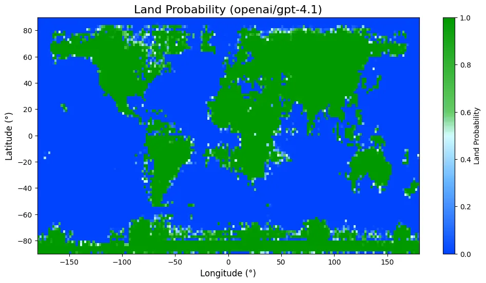

# Geographic Coordinates Visualization

*Hypothesis**: LLM geographic knowledge may simply reflect coordinate density in training data rather than spatial reasoning. If true, plotting Wikipedia coordinates should correlate with how well language models can map Earth's landmasses.

> Response to: https://outsidetext.substack.com/p/how-does-a-blind-model-see-the-earth

Wikipedia co-ordinate map vs LLM map:


## Overview

This project downloads geographic coordinate data from Wikipedia entities and creates visualizations showing their global distribution. The resulting map may reveal whether AI models are memorizing coordinate patterns from text rather than developing true geographic understanding.

Wikipedia GCS co-ordinate map:


LLM generated map GPT-4.1:


Delta GIF:


## Usage

### 1. Download Data

Get the coordinate data using the wiki coordinates grabber:

```bash
git clone https://github.com/placemarkt/wiki_coordinates_grabber
# Follow their instructions to generate coords.csv
```

### 2. Process Data

Filter and clean the coordinate data:

```bash
python filter_coords.py coords.csv > coords_filtered.csv
```

### 3. Visualize

The resulting plot shows the geographic distribution of Wikipedia entities with coordinate data.

## Data Source
Coordinate data sourced from [placemarkt/wiki_coordinates_grabber](https://github.com/placemarkt/wiki_coordinates_grabber).
